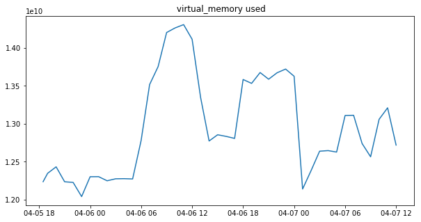
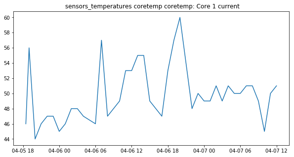
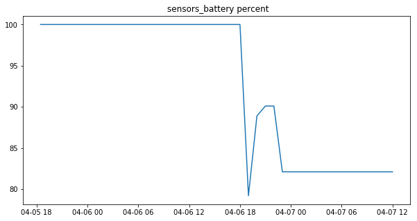

# Summary

[WatchMe](https://vsoch.github.io/watchme/) is a simple tool to allow for reproducibly watching for changes in one or more 
web pages, system resources, or any task function that is provided to the library.
It addresses a problem in research that it's highly challenging to create and share
reproducible tasks, meaning:

 1. a configuration file (recipe) stores the parameters for tasks including a function to run, a frequency, and any other necessary variables
 2. the tasks are automatically run at some frequency
 3. the results of the runs are saved automatically via version control
 4. the results collected can be re-assembled into temporal data structures that are ready for analysis
 5. the entire base (configuration, tasks, and results) can be shared via GitHub, and reproduced by others

With WatchMe, a researcher can easily generate a repository (a watcher) that is configured
to run one or more tasks at a particular frequency, and automatically commit changes to git.
If he or she chooses, the repository can be pushed to a version control service like GitHub,
and the entire configuration and set of tasks is easily reproducible by anyone that uses
the client to get the repository. Each watcher uses git not only for version control of
configuration files, but as a temporal database from which the results of the task runs can
be extracted. Every change to a task within a watcher directory is also recorded via
git, making the entire setup well documented with minimal to no work needed by the
researcher.

## Background

Reproducible monitoring and data collection for an individual researcher is a challenging task. Typically,
if a web page or system resource is to be monitored, the researcher must write custom scripts and
extraction steps, and in the best case scenario, he or she uses version control for the scripts or final
result. While many online services exist to watch for changes in one or more web pages
(e.g., see https://visualping.io/ for an example service), these resources are problematic
for research use. Specifically:

 1. It's typically the case that you will be charged for more than a few pages
 2. It's not appropriate for a research setting where you would want programmatic parsing
 3. The configuration of your watcher is not reproducible.

Thus, WatchMe is ideal for the individual researcher that does not want to (or cannot)
pay for a service, and wants to be able to share their monitoring tasks with other
researchers, such as for a publication or similar. It also allows for collaborative data
collection, as multiple users can run the equivalent task, have data exported named
uniquely, and then submit a pull request to combine the data. 


## WatchMe Tasks

By default, WatchMe comes with two task types intended to provide general templates
for creating specific monitoring tasks.

### Web Tasks

It's a common need to want to retrieve content from the web, whether that be a request
to get a page, a subset of a page, the download of a file, or a post to an application
programming interface (API). These general tasks perform these operations, with customizations
to control the url, how the response is parsed, headers and parameters, and the result written. 
For example, the  general set of web tasks can be used to check a set of cities for changes to weather or climate,
to monitor an API endpoint, track changes in prices of item(s) of interest, 
download a file at some frequency, or watch a job board for changes. For details about
setup and usage, see the [urls tasks](https://vsoch.github.io/watchme/watchers/urls/) 
documentation.


### System Tasks

The psutils library of functions uses the Python Psutil [@psutil] set of functions
to monitor system resources, sensors, and python environment. Given the naming of data outputs
based on the host, if a second user forked the example repository
and ran it on his or her host, he or she could open a pull request to contribute new data. 
Given the unique naming of each task file, the data could co-exist with previous
data generated on other hosts. Given the common export formats,
common analyses could be shared and run on the exports by the different users.
See the [psutils tasks](https://vsoch.github.io/watchme/watchers/psutils/) 
documentation for details, and continue reading for a specific example.
An example that uses the set of system tasks is discussed next.


## Research Usage

The command line usage of watchme, along with making the tool programmatic, 
also makes it ideal for usage on research clusters, or custom usage within scripts.
Importantly, WatchMe is able to take a repository of result files produced by one
or more contributors, and export data structures that keep a record of timestamps,
results, and commit ids for each addition of a results file.

### Watcher Example

As an example, the repository [watchme-system](https://github.com/vsoch/watchme-system) runs a
set of hourly tasks to measure the host networking, cpu and memory usage, sensors 
(battery, temperature, fans), and other user and python-specific data. After installing
watchme, a second researcher could easily obtain the task by doing:

```bash
$ watchme get https://www.github.com/vsoch/watchme-system system
```

The command above would clone the repository, check that it was a valid Watcher (indicated
by presence of a configuration file named watchme.cfg) and then download the folder
to a new watcher named "system" (the second argument) in the default Watchme base folder,
located at $HOME/.watchme. The organization of any watcher is intuitive - the top level
folder is the name for the watcher, and the folders inside that begin with "task-" 
represent the various task folders:

```bash
/.watchme/system$ tree
.
├── README.md
├── task-cpu
│   ├── TIMESTAMP
│   └── vanessa-thinkpad-t460s_vanessa.json
├── task-memory
│   ├── TIMESTAMP
│   └── vanessa-thinkpad-t460s_vanessa.json
├── task-network
│   ├── result.json
│   ├── TIMESTAMP
│   └── vanessa-thinkpad-t460s_vanessa.json
├── task-python
│   ├── TIMESTAMP
│   └── vanessa-thinkpad-t460s_vanessa.json
├── task-sensors
│   ├── TIMESTAMP
│   └── vanessa-thinkpad-t460s_vanessa.json
├── task-system
│   ├── TIMESTAMP
│   └── vanessa-thinkpad-t460s_vanessa.json
├── task-users
│   ├── TIMESTAMP
│   └── vanessa-thinkpad-t460s_vanessa.json
└── watchme.cfg
```

Notice that each task folder has a result file, along with a timestamp to indicate 
when the watcher was last run. The user can edit the watchme.cfg if desired, or simply
activate and schedule the watcher (optionally disabling a subset of tasks) to run 
at some frequency (e.g., hourly) and commit to git. No further work is required 
by the researcher, other than keeping the host machine turned on. The researcher can push the results
to a GitHub repository (as was done in this case) and at any time, export the results
for a particular result file. In the command below, we use the "watchme" client to export the watcher folder "system"
for a task called "task-memory". We ask the watcher to parse the result content as json: 


```bash
$ watchme export system task-memory vanessa-thinkpad-t460s_vanessa.json --json
```
```python
{
    "commits": [
        "02bccc9b0dbbd885125ae653fa5034dbf1d15eb4",
        "d98aaaae49c2c5106393beff5ebb51225eba8ac6",
        ...
    ],
    "dates": [
        "2019-04-07 15:00:02 -0400",
        "2019-04-07 14:00:02 -0400",
       ...
    ],
    "content": [
        {
            "virtual_memory": {
                "total": 20909223936,
                "available": 6038528000,
                "percent": 71.1,
                "used": 13836861440,
                "free": 201441280,
                "active": 16094294016,
                "inactive": 3581304832,
                "buffers": 3842781184,
                "cached": 3028140032,
                "shared": 736833536
            }
        },
        {
            "virtual_memory": {
                "total": 20909223936,
                "available": 6103392256,
                "percent": 70.8,
                "used": 13769531392,
                "free": 202334208,
                "active": 16014094336,
                "inactive": 3663310848,
                "buffers": 3859390464,
                "cached": 3077967872,
                "shared": 755183616
            }
        },
        ...
    ]
}
```

While only two commits are shown in the result above, an actual export for
this particular watcher has results for memory metrics collected on the hour.
The researcher could then perform an [analysis](https://github.com/vsoch/watchme-system/blob/master/data/watchme-task-analysis.ipynb) 
using the data collected. As an example, here is a plot from such an analysis that
tracks virtual memory usage of this author, recorded every hour,
 over two weekend days. 



Interestingly, we can see a pattern that correlates with the activity of the author
during the day. Virtual memory usage is low from the previous evening (1800 hours)
through the early morning (0600 hours) and then rises sharply when the author starts
to work. It goes down briefly in the early afternoon when the author pauses for a break,
and picks up afterward, stopping when it's time for dinner. We see that the
system's core temperature follows a similar trend:



and that the computer was briefly unplugged after the morning work session.




These kind of metrics are interesting to answer research questions about system
resources and behavior, and represent only the tip of the iceberg in terms of the
scope of data that WatchMe could help collect. For other examples, see the 
[WatchMe Examples](https://vsoch.github.io/watchme/examples) page.

More information on WatchMe, including examples, information on watcher tasks, and function documentation is provided at the WatchMe <a href="https://vsoch.github.io/watchme/" target="_blank">documentation</a>. Others are encouraged to give feedback, ask questions, and request
new task functions or examples on <a href="https://www.github.com/vsoch/watchme/issues" target="_blank">the issue board</a>.

# References
